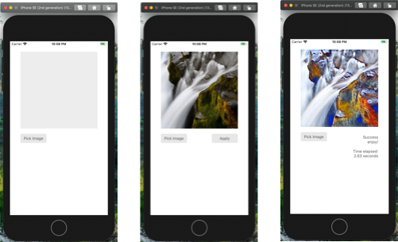

# An iOS demo app to show CoreML Style Transfer model usage

Demo app for article: http://collectivemind.blog/how-to-convert-any-machine-learning-model-for-the-ios-application-and-build-it-into-the-project

This simple app uses Fast Style Transfer to stylize images

Colab notebook for training .mlmodel: https://colab.research.google.com/drive/1kq7hXi75oSiqZjqPn2q-rIvl3Fa4st5l#scrollTo=0onOHTRyPQWg
